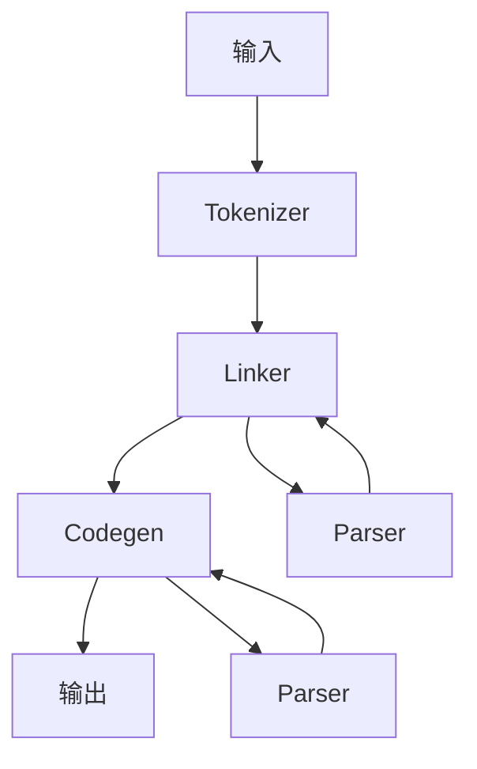
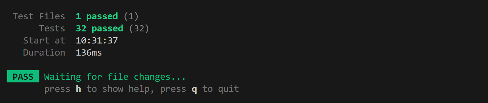
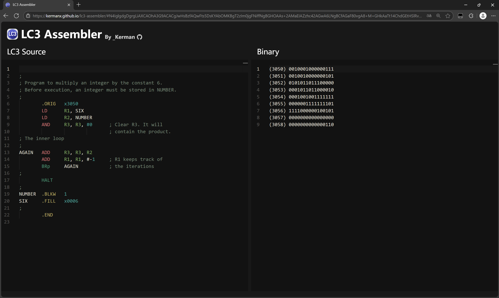

# LAB A: Visual LC-3

## 总体设计

考虑到 LC-3 的语法具有以下特点：

- 一行至多只有一条语句
- 语句的格式固定且简单
- Linker 阶段不需要知道指令的具体含义，只需要分析伪指令

故设计了如下的汇编流程：



其中，不包含单独的 Parser 步骤。Tokenizer 将语句分割好，而 Linker 和 Codegen 则在碰到具体要分析的语句时调用 Parser 去 parse 参数，如寄存器和立即数。

## Tokenizer

Tokenizer 会将输入的代码分割成行，每行会分析出标签、指令、注释等部分。不是典型的 Tokenizer，具备一些 Parser 的功能。

```ts
export interface Line {
  source: string // 原始代码，用于 debug
  labels: string[] // 代码前的标签
  instruction: string[] // 指令的各部分，如 ['ADD', 'R0', 'R1', 'R2'] 或 ['.ORIG', 'x3000']
  comment: string // 指令末尾的注释
  address?: number // 地址，初始为空，由 Linker 填充
}
```

实现上，对于每行，进行如下步骤：

1. 首先遍历字符串，解析出末尾的字符串字面量和注释
2. 对于剩下的部分，以 `','` 进行分割，除去第一部分外后面的肯定是指令的参数
3. 对于第一部分，再以空白字符分割，并判断出哪些是标签，哪些是指令的部分

具体实现参见 `src/tokenizer.ts`。

## Linker

Linker 会分析出各个标签定义处的地址，并给每个 Line 填充地址信息。

Linker 需要分析如下伪指令：

- `.ORIG`
- `.FILL`
- `.BLKW`
- `.STRINGZ`
- `.END`

并根据它们来增加当前地址。

对于其他的普通指令，地址增加 1，不需要分析具体是什么指令。

具体实现参见 `src/linker.ts`。

## Codegen

Codegen 会分析出每个指令的具体含义，并生成对应的机器码。

`src/opcodes.ts` 实现了每个指令的解析和生成，`src/codegen.ts` 调用它们，综合生成机器码。

对于每一条指令，Codegen 会给出一个 context，提供了一系列有用的操作：

```ts
export interface CodegenCtx {
  /** 获取指定个数的操作数。若个数不对则报错 */
  getOperands: (count: number) => string[]
  /** 打印指定位数的二进制数。若超出范围则报错 */
  binary: (value: number, bits: number, unsigned?: boolean) => string
  /** 尝试以寄存器的形式解析，若不是寄存器则返回，否则打印操作数 */
  tryRegister: (register: string) => string | null
  /** 强制以寄存器的形式解析和打印，否则报错 */
  register: (register: string) => string
  /** 强制以立即数或标签的形式解析和打印，否则报错 */
  immediate: (immediate: string, bits: number, unsigned?: boolean) => string
}
```

其中值得一提的是 `binary` 函数，它会将一个数转换为二进制字符串，若超出范围则报错:

```js
function binary(value, bits, unsigned = false) {
  const min = unsigned ? -(2 ** bits - 1) : -(2 ** (bits - 1))
  const max = unsigned ? 2 ** bits - 1 : 2 ** (bits - 1) - 1
  if (value < min || value > max) {
    throw new LC3Error(`Value out of range: ${value} (min: ${min}, max: ${max})`)
  }
  if (value < 0) {
    value = unsigned ? -value : 2 ** bits + value
  }
  return value.toString(2).padStart(bits, '0')
}
```

还有 `immediate` 函数，它会将立即数或标签转换为二进制字符串，若超出范围则报错：

```js
function immediate(immediate, bits, unsigned) {
  const value = tryParseImmediate(immediate)
  if (value !== null) {
    return context.binary(value, bits, unsigned)
  }
  const labeled = symbols[immediate]
  if (!labeled) {
    throw new LC3Error(`Symbol not found: ${immediate}`)
  }
  // address 是当前指令的地址，来自 Linker 阶段的计算
  return context.binary(labeled - address - 1, bits, unsigned)
}
```

关于 opcodes 的实现，请看下一节。

以上是普通指令的打印。对于伪指令，可能要填充一些数据。注意 `.STRINGZ` 要在末尾填 0。

具体实现参见 `src/codegen.ts`。

## Opcodes

`src/opcodes.ts` 实现了每个指令的解析和生成。以 `ADD` 和 `AND` 为例，不需要重复的代码，可以使用一个函数生成：

```ts
function createAddOrAnd(opcode: string): OpcodeHandler {
  return function (ctx) {
    const [rd, rn, operand2] = ctx.getOperands(3)
    let op2 = ctx.tryRegister(operand2)
    op2 = op2 ? `000${op2}` : `1${ctx.immediate(operand2, 5)}`
    return `${opcode}${ctx.register(rd)}${ctx.register(rn)}${op2}`
  }
}

export const opcodes: Record<string, OpcodeHandler> = {
  ADD: createAddOrAnd('0001'),
  AND: createAddOrAnd('0101'),
  // ... other opcodes
}

// Add lowercase opcodes
for (const name in opcodes) {
  opcodes[name.toLowerCase()] = opcodes[name]
}
```

`BR` 指令也是类似的：

```ts
function createBr(cond: string): OpcodeHandler {
  return function (ctx) {
    const [label] = ctx.getOperands(1)
    const offset = ctx.immediate(label, 9)
    return `0000${cond}${offset}`
  }
}

export const opcodes: Record<string, OpcodeHandler> = {
  // ... other opcodes
  BR: createBr('111'),
  BRn: createBr('100'),
  // ... other BRs
  // ... other opcodes
}
```

同时，这一过程也检测了指令的合法性。

## 错误处理

在 Tokenizer、Linker 和 Codegen 阶段，若出现错误，会抛出一个 `LC3Error`。同时，对每一行的循环会去 catch 这个错误，并追加上行数信息。

如果捕获的错误不是 `LC3Error`，则会直接抛出，这样可以保证不会有未知错误被忽略。

## 测试

本代码使用 [Vitest](https://vitest.dev) 进行测试。fixtures 为 C/C++ 模板里的测试用例，加上了一些额外的测试用例，共 32 个。测试在 130ms 左右完成，全部通过。在 GitHub Action 上亦有 CI 测试，保证代码的正确性。



## UI

本程序提供了一个简单的网页 UI，可以在线输入 LC-3 汇编代码，然后生成机器码。UI 使用 Vue 和 UnoCSS 构建，以 Monaco Editor 作为代码编辑器，可以高亮 LC-3 汇编代码:



网址：https://kermanx.github.io/lc3
