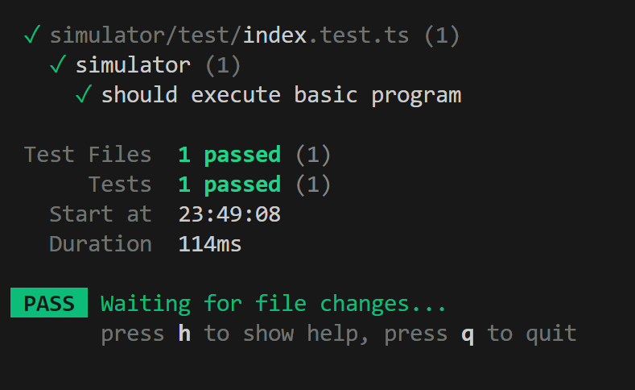

# LAB S: Re LC-3

## 总体设计

- `decoder.ts`：解码指令的逻辑
- `state.ts`：运行环境的状态，内存、寄存器、PC 等
- `opcodes.ts`：各指令的实现
- `traps.ts`：支持的中断的实现
- `index.ts`：整合上述模块，实现模拟器

## Decoder

对于每一个指令，会创建一个 Decoder，方便按顺序解析指令的各个部分。

一个 Decoder 的实例会有如下属性：

- `opcode`：指令的 opcode
- `eat(bits: number): string`：吃掉指定长度的 bits，返回吃掉的部分
- `unsigned(bits: number): number`：解析无符号整数
- `signed(bits: number): number`：解析有符号整数
- `reg(bits: number): number`：解析寄存器编号
- `bool(): boolean`：解析 1bit 的布尔值

具体实现参见 `simulator/src/decoder.ts`。

## State

State 保存了整个模拟器的状态，包括：

- 内存：长度为 65536 的 `Uint16Array`
- 寄存器：长度为 8 的 `Uint16Array`
- PC：程序计数器，`number`
- CC：条件码寄存器，`[number, number, number]`，分别表示 N、Z、P
- halted：是否停机，`boolean`
- inputBuffer：输入缓冲区，`string`
- outputBuffer：输出缓冲区，`string`

此外，还提供了一个 `setCC` 方法，用于设置条件码寄存器。需要注意的是，`Unit16Array` 中取出的永远是无符号整数，需要用 `value & 0x8000` 来判断是否为负数。

具体实现参见 `simulator/src/state.ts`。

## Opcodes

有了以上两个模块，就可以以一种很美妙的方式实现指令的解析和执行。以下是有代表性的指令实现：

```ts
export const opcodes: Record<OP_CODE, (decoder: Decoder, state: State) => void> = {
  [OP_CODES.ADD](decoder, state) {
    const rd = decoder.reg(3) // 除去 opcode，前 3 位是目标寄存器
    const sr1 = decoder.reg(3) // 接下来 3 位是源寄存器 1
    const i = decoder.bool() // 是否立即数
    const sr2 = i // 根据是否立即数，取不同的值
      ? decoder.signed(5)
      : state.reg[decoder.reg(3)]
    state.reg[rd] = state.reg[sr1] + sr2 // 执行 ADD 操作
    state.setCC(state.reg[rd]) // 设置条件码
  },
  // ...
  [OP_CODES.BR](decoder, state) {
    // decode condition
    const n = decoder.bool()
    const z = decoder.bool()
    const p = decoder.bool()
    // 判断是否跳转
    const jump = (n && state.cc[0]) || (z && state.cc[1]) || (p && state.cc[2])
    if (jump) {
      const pcOffset = decoder.signed(9)
      // 更新 PC
      state.pc += pcOffset
    }
  },
  // ...
  [OP_CODES.LDI](decoder, state) {
    const rd = decoder.reg(3)
    const pcOffset = decoder.signed(9)
    // 间接寻址
    state.reg[rd] = state.mem[state.mem[state.pc + pcOffset]]
    state.setCC(state.reg[rd])
  },
  // ...
  [OP_CODES.TRAP](decoder, state) {
    decoder.eat(4)
    const trapVector = decoder.unsigned(8) as TRAP_CODE
    // 找到对应的中断处理函数，下一节介绍
    const handler = traps[trapVector]
    if (!handler) {
      throw new LC3Error(`Invalid/unsupported trap vector: ${trapVector}`)
    }
    handler(state)
  },
  [OP_CODES._Reserved](_decoder, _state) {
    throw new LC3Error('Reserved opcode')
  },
}
```

完整的实现参见 `simulator/src/opcodes.ts`。

## Traps

实现了一些中断处理函数，没有什么很特别的地方：

```ts
export const traps: Record<TRAP_CODE, (state: State) => void> = {
  [TRAP_CODES.GETC](state) {
    // 从输入缓冲区读取一个字符
    // 由于整个模拟器是同步的，所以不能等待输入，只能从缓冲区读取
    if (state.inputBuffer.length === 0) {
      throw new LC3Error('Input buffer is empty')
    }
    state.reg[0] = state.inputBuffer.charCodeAt(0)
    state.inputBuffer = state.inputBuffer.slice(1)
  },
  // ...
  [TRAP_CODES.PUTS](state) {
    let address = state.reg[0]
    let char = state.mem[address]
    while (char) {
      state.outputBuffer += String.fromCharCode(char)
      char = state.mem[++address]
    }
  },
  // ...
  [TRAP_CODES.HALT](state) {
    // 停机
    state.halted = true
  },
}
```

完整的实现参见 `simulator/src/traps.ts`。

## Index

这是 Simulator 的主体。以下是主要的代码：

```ts
export function createSimulator() {
  // 模拟器的状态
  const state = createState()

  // 初始化模拟器的 PC 和内存
  function load(start: number, mem: number[] | string) {
    state.pc = start
    if (typeof mem === 'string') {
      mem = mem.trim().split(/\r?\n/).filter(Boolean).map(line => Number.parseInt(line.trim(), 2))
    }
    state.mem.set(mem, start)
  }

  // 执行一步
  function step() {
    // 先读取指令
    const inst = state.mem[state.pc].toString(2).padStart(16, '0')
    // 然后增加 PC
    state.pc++
    // 每个指令都有专属的 Decoder
    const decoder = createDecoder(inst)
    // 找到对应的指令处理函数
    const handler = opcodes[decoder.opcode as keyof typeof opcodes]
    // 执行
    handler(decoder, state)
  }

  // 运行，直到停机
  function run() {
    while (!state.halted) {
      step()
    }
  }

  return {
    state,
    load,
    step,
    run,
  }
}
```

完整的实现参见 `simulator/src/index.ts`。

## 测试

本代码使用 [Vitest](https://vitest.dev) 进行测试。数据来自 Kotlin 模板，正确通过。在 GitHub Action 上亦有 CI 测试，保证代码的正确性。



## 代码仓库

- [GitHub](https://github.com/kermanx/lc3)
